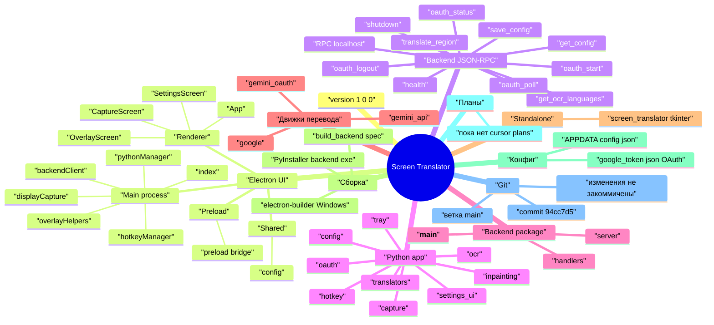

# Roadmap — Screen Translator

> Сгенерировано автоматически: **2026-06-10**
> Команда: `npm run roadmap` или `node scripts/generate-roadmap-mindmap.mjs`

Mindmap отражает **текущее состояние** репозитория: модули, RPC-методы, сборку и открытые пункты ручного тестирования из README.

> **Как отрисовать:** встроенный Markdown Preview не рисует `mindmap`.
> Откройте `docs/ROADMAP.html` в браузере или выполните `npm run roadmap:view`.

## Mindmap



## Как обновить

```powershell
npm run roadmap
```

После крупных изменений перегенерируйте файл и закоммитьте как `docs(roadmap): обновить mindmap`.

## Планы фич

_Планов в `.cursor/plans/` пока нет. Для фичи вызовите `/planner`._


## Уровни документации

| Документ | Назначение |
|----------|------------|
| `docs/ROADMAP.md` | Снимок состояния проекта (этот файл) |
| `.cursor/plans/*.md` | Детальный план одной фичи |
| `README.md` | Архитектура и запуск |
| `docs/ROADMAP.html` | Интерактивный просмотр mindmap в браузере |
